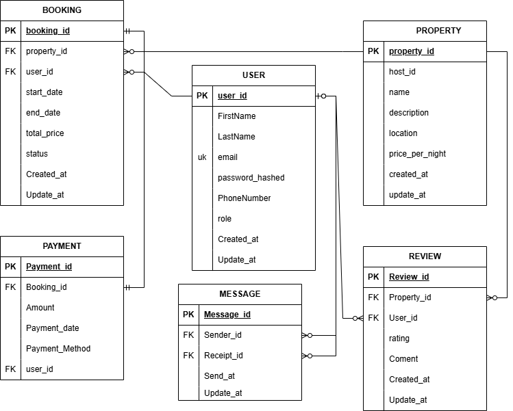

# Airbnb Database - Requirements Specification

## Project Overview
This document outlines the database requirements for an Airbnb-like application that manages users, properties, bookings, reviews, payments, and messaging between guests and hosts.

## Core Entities

### USER
The USER entity stores information about all users in the system, including guests, hosts, and administrators. Key attributes include user_id (primary key), FirstName, LastName, email (unique), password_hashed, PhoneNumber, role, Created_at, and Update_at. Users can act as both guests and hosts within the platform.

### PROPERTY
The PROPERTY entity represents rental listings created by hosts. It contains property_id (primary key), host_id (foreign key to USER), name, description, location, price_per_night, created_at, and update_at. Each property is owned by one host, but hosts can list multiple properties.

### BOOKING
The BOOKING entity manages reservations between guests and properties. Attributes include booking_id (primary key), property_id (foreign key to PROPERTY), user_id (foreign key to USER), start_date, end_date, total_price, status, Created_at, and Update_at. This entity links guests to properties for specific date ranges.

### PAYMENT
The PAYMENT entity tracks financial transactions for bookings. It includes Payment_id (primary key), Booking_id (foreign key to BOOKING), Amount, Payment_date, Payment_Method, and user_id (foreign key to USER). Multiple payments can be associated with a single booking.

### REVIEW
The REVIEW entity stores guest feedback on properties. Attributes include Review_id (primary key), Property_id (foreign key to PROPERTY), User_id (foreign key to USER), rating (1-5), Coment, Created_at, and Update_at. Each user can review a property only once.

### MESSAGE
The MESSAGE entity enables communication between users. It contains Message_id (primary key), Sender_id (foreign key to USER), Receipt_id (foreign key to USER), Send_at, and Update_at. This supports direct messaging between guests and hosts.

## Entity-Relationship Diagram

